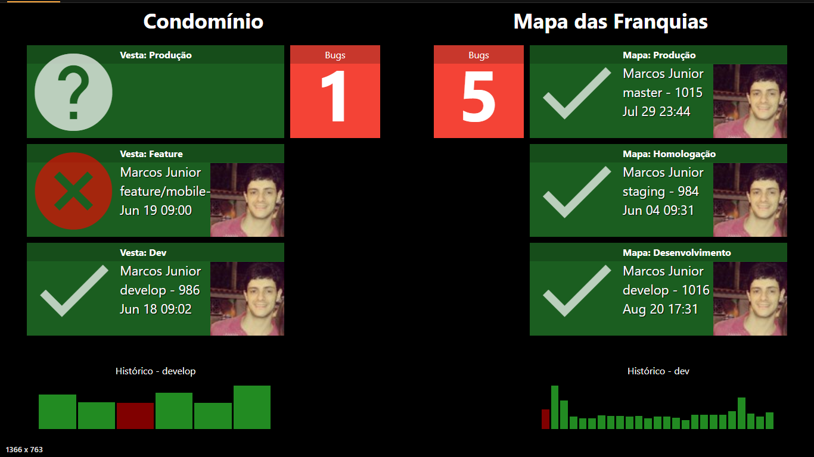

# Dash-CI

Dash-CI is a simple dashing.io like dashboard to show (almost) real time continuous integration tasks status and other project information.  

This application fits best using Google Chrome, full screen (F11) at a TV or large monitor. Current version does not have the intent to be used at PC's or touch devices.

### Running

There are two options for running Dash-CI: Online from github.io or local at your machine with node or any web server. 

To run online, goto http://junalmeida.github.io/dash-ci/dist

To run from source, download, extract and run `npm install` and `npm start`.

You can also use the prepared package at https://github.com/junalmeida/dash-ci/releases

Dash-Ci does not need a back-end. It uses browser local storage to save settings and service API's, but you need a server to serve static files since CORS does not allow XHR requests to local files.

First version ships with Microsoft TFS (or Visual Studio Online) widgets and Gitlab widgets. 

### Usage

Run online and click at the edit button to add or configure global options.

If this is your first usage, you need to set gitlab and/or tfs host and private access key. 

If using TFS 2015 (that uses only NTLM), use the tfs-onpremises-ntlm executable. Use the tray icon to open the client. To run on linux, set ntlm credentials at config and run the executable as root.

### Widgets 

1. **Label:**  A simple label to create semantic areas at your dashboard.
2. **Clock:**  A simple clock with current date and time.

3. **TFS - Build:** Shows status of latest build definition run from a tfs project.
4. **TFS - Build Graph:** Shows status with a graph of N build runs in a row from a tfs project.
5. **TFS - Query Count:** Runs a saved query from tfs and show the items count. Useful to show open bugs, issues, etc.
6. **TFS - Query Chart:** Runs a saved query from tfs and show the items count. Useful to show open bugs, issues, etc.
7. **TFS - Releases:** Shows status of latest release definition run from a tfs project.
8. **TFS - Post Its:** Shows a post-it view of any query.
 
9. **Gitlab - Pipeline:** Shows status of latest pipeline run from a gitlab project.
10. **Gitlab - Pipeline Graph:** Shows status with a graph of N pipeline runs in a row from a gitlab project.
11. **Gitlab - Issue Query:** Counts issues at gitlab by group or project, filtering by label and state.

12. **Custom API - Count:** Shows a count of any custom REST API.
13. **Custom API - Post It:** Shows a view of post its of any custom API.

### Feedback

If you like this project, feel free to suggest or report a bug at github issues page. 

Please contribute with photos of Dash-CI running at your TV's